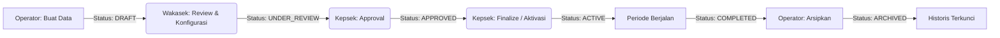

# Audit Komprehensif: Tahun Ajaran & Semester (RBAC SaaS Sekolah)

> **Dokumen Audit Teknis & Arsitektur RBAC**  
> **Target Platform:** SaaS Multi-Jenjang (SD/MI, SMP/MTs, SMA/MA, SMK)  
> **Status Implementasi Saat Ini:** Analisis Kesiapan & Temuan Masalah (Read-Only Audit)  
> **Tanggal Audit:** 18 September 2026  

---

## 1. Baseline Blueprint RBAC SaaS Sekolah

Audit ini mengacu pada standar arsitektur RBAC SaaS multi-sekolah skala nasional:

$$\text{Role} \longrightarrow \text{Permission} \longrightarrow \text{Scope} \longrightarrow \text{Workflow} \longrightarrow \text{Audit Log}$$

Bukan sekadar sistem **Role $\rightarrow$ CRUD** sederhana.

### Prinsip Pemilik Domain (Separation of Duties)
1. **Operator (Data & System Administration):** Pelaksana administrasi teknis sistem (Siswa, Guru, Akun, Import/Export, Sinkronisasi). Operator **bukan penentu kebijakan akademik**.
2. **Wakasek Kurikulum (Academic Domain Owner):** Pemilik kebijakan akademik (Kurikulum, Mapel, Alokasi Jam, Tahun Ajaran, Semester, Jadwal, Rapor).
3. **Kepala Sekolah (Approval & Oversight):** Pimpinan sekolah dengan hak review, approval, aktivasi/pengesahan, dan pengawasan. Kepsek **tidak membutuhkan Full CRUD** di semua modul.
4. **Guru & Wali Kelas:** Pelaksana kegiatan belajar mengajar dengan wewenang write terbatas pada kelas/tugasnya, dan hak akses **Read-Only** pada konfigurasi akademik (Tahun Ajaran, Semester, Kurikulum).
5. **Super Admin:** Pengelola platform SaaS di level multi-tenant (Subscription, Tenant, Feature Flags, Platform Audit), tidak mengintervensi konfigurasi operasional harian sekolah.

### Alur Ideal Tahun Ajaran


---

## 2. Ringkasan Eksekutif Hasil Audit

1. **Status Lifecycle Tahun Ajaran Sebagian Sudah Dibangun:**  
   Backend telah mengadopsi enum `StatusTahunAjaran` (`draft`, `under_review`, `approved`, `active`, `completed`, `archived`). Kepsek juga telah memiliki dashboard approval khusus di frontend (`TahunAjaranKepsek.jsx`).
2. **Terjadi Deadlock Permission Kritis (P0 Bug):**  
   Terdapat kontradiksi antara `SchoolSeeder.php`, `TahunAjaranPolicy.php`, dan `master-data.php`. Pada instansiasi sekolah baru, **tidak ada satupun role yang bisa membuat Tahun Ajaran** karena Operator diblokir Route Middleware, sedangkan Wakasek diblokir Policy.
3. **Semester Belum Menjadi Entitas Mandiri (First-Class Domain):**  
   Tidak ada `SemesterController` dan tidak ada permission khusus semester. Semester hanya diperlakukan sebagai kolom tanggal turunan yang menumpang di Tahun Ajaran.
4. **Hardcoding Role Masih Mendominasi Policy:**  
   `TahunAjaranPolicy.php` masih menggunakan pengecekan string role kaku (`$user->hasRole('operator')`, dll), alih-alih mengevaluasi permission dinamis (`hasPermission(...)`).
5. **Akses Guru & Wali Kelas Terblokir Total (403 Forbidden):**  
   Seluruh route master data dibatasi hanya untuk `operator,kepsek,wakasek,super_admin`, sehingga Guru dan Wali Kelas tidak bisa membaca Tahun Ajaran/Semester aktif.
6. **Masalah Penguncian Data yang Kaku (Over-Locking):**  
   Saat status Tahun Ajaran menjadi `ACTIVE`, seluruh pembaruan dicegah oleh lock rule (Error 422). Akibatnya, Wakasek tidak bisa memperbarui rentang tanggal Semester Genap ketika tahun ajaran sudah berjalan.

---

## 3. Matriks Evaluasi: Blueprint vs Realitas Kode

| Fitur / Dimensi | Blueprint Ideal | Kondisi Aktual di Kode | Status |
| :--- | :--- | :--- | :---: |
| **Prinsip Evaluasi Izin** | `hasPermission('academic.year.*')` dinamis | Banyak dicek via `$user->hasRole(...)` di Policy | ⚠️ **Menyimpang** |
| **Operator - Buat TA** | Boleh buat (status `DRAFT`) | Dicek `$user->hasRole('operator')` di Policy, TAPI dicek `permission:master_data.tahun_ajaran.manage` di Route | 🔴 **Deadlock Bug** |
| **Wakasek - Kelola TA** | Review & Configure akademik | Diberi `tahun_ajaran.manage` di Seeder, tapi Policy `create` & `delete` menolak Wakasek | ⚠️ **Konflik Wewenang** |
| **Kepsek - Approval TA** | Approve, Reject, Activate | Sudah ada: endpoint `/approve`, `/reject`, `/aktifkan`, dan UI khusus | 🟢 **Sesuai** |
| **Guru & Wali Kelas** | Read-Only (melihat TA & Semester aktif) | Diblokir total oleh Route Group Middleware | 🔴 **Terblokir (403)** |
| **Entitas Semester** | Punya Create, Update, Archive, Workflow mandiri | Tidak ada Controller khusus; tanggal semester menumpang di update TA | ⚠️ **Subordinat** |
| **Edit Tanggal Semester** | Wakasek bisa mengatur ritme/tanggal semester berjalan | Terkunci total (Error 422) jika status TA sudah `APPROVED` atau `ACTIVE` | 🔴 **Problem Operasional** |
| **Arsip Semester** | Ada mekanisme Archive (bukan hard delete) | Hanya ada `is_active` (boolean) & soft delete; tidak ada status/arsip | ⚠️ **Belum Lengkap** |
| **Audit Log** | Tercatat siapa, kapan, aksi apa | `ActivityLog` sudah mencatat event TA, tapi belum granular untuk semester | 🟡 **Cukup Baik** |

---

## 4. Temuan Kritis & Analisis Root Cause

### 🔴 Temuan 1: Deadlock Pembuatan Tahun Ajaran Baru (Critical Bug)

**Lokasi Berkas:**
- Route: `backend/routes/api/master-data.php` (baris 258–260)
- Seeder: `backend/database/seeders/SchoolSeeder.php` (baris 364–376)
- Policy: `backend/app/Policies/TahunAjaranPolicy.php` (baris 44–47)

**Detail Masalah:**
1. Di Route Middleware:
   ```php
   Route::middleware('permission:master_data.tahun_ajaran.manage')->group(function () {
       Route::post('/tahun-ajaran', [TahunAjaranController::class, 'store']);
   ```
2. Di `SchoolSeeder.php`, Operator secara eksplisit **dikecualikan** dari permission `manage`:
   ```php
   'operator' => array_values(array_filter(
       $all,
       fn($slug) => !in_array($slug, [
           'master_data.tahun_ajaran.manage', // <-- Operator TIDAK punya permission ini!
           ...
       ])
   )),
   ```
   *Wakasek yang diberikan permission `master_data.tahun_ajaran.manage`.*
3. Di `TahunAjaranPolicy.php`:
   ```php
   public function create(User $user): bool
   {
       return $user->hasRole('operator'); // <-- Menolak siapapun yang bukan operator!
   }
   ```

**Dampak Lapangan:**
- **Operator** mencoba `POST /tahun-ajaran` $\rightarrow$ Dicegat oleh Route Middleware (HTTP 403) karena tidak memiliki `master_data.tahun_ajaran.manage`.
- **Wakasek** mencoba `POST /tahun-ajaran` $\rightarrow$ Lolos Route Middleware, tapi dicegat oleh Policy (HTTP 403) karena bukan role `operator`.
- Di UI frontend (`TahunAjaranSemester.jsx` baris 348), tombol *Tambah Tahun Ajaran* diproteksi `{canManage && ...}`, sehingga Operator bahkan tidak melihat tombolnya.

---

### 🔴 Temuan 2: Hardcoding Role di Level Policy (Melanggar Prinsip #12)

**Lokasi Berkas:** `backend/app/Policies/TahunAjaranPolicy.php`

**Detail Masalah:**
Pengecekan hak akses di Policy mengikat string nama role:
- Baris 29 & 35: `$user->hasAnyRole(['operator', 'wakasek', 'kepsek'])`
- Baris 46: `$user->hasRole('operator')`
- Baris 66: `$user->hasAnyRole(['operator', 'wakasek'])`
- Baris 78: `$user->hasRole('wakasek')`
- Baris 89 & 100 & 111: `$user->hasRole('kepsek')`

**Dampak Arsitektur SaaS:**
Sistem kehilangan fleksibilitas delegasi tugas. Jika sekolah menugaskan peran kustom (misalnya *"Plt. Kepala Sekolah"* atau *"Staf Kurikulum"*), sistem akan menolak otorisasi meskipun permission sudah diberikan, karena Policy memeriksa nama role secara hardcode.

---

### 🔴 Temuan 3: Isolasi Total Guru & Wali Kelas dari Informasi Akademik

**Lokasi Berkas:** `backend/routes/api/master-data.php` (baris 24–26)

**Detail Masalah:**
```php
Route::middleware(['auth:sanctum', 'role:operator,kepsek,wakasek,super_admin'])
    ->prefix('operator/master-data')
    ->group(function () {
```
Seluruh rute master data (termasuk `GET /tahun-ajaran` dan `GET /tahun-ajaran/{ulid}`) berada di bawah proteksi role di atas. Guru dan Wali Kelas tidak termasuk dalam daftar role tersebut.

**Dampak Lapangan:**
Guru dan Wali Kelas tidak memiliki akses resmi ke endpoint data Tahun Ajaran atau Semester aktif. Modul absensi, penilaian, jurnal mengajar, dan LMS kesulitan mengambil referensi periode aktif secara konsisten melalui API standar.

---

### 🔴 Temuan 4: Semester Belum Menjadi Entitas Mandiri

**Lokasi Berkas:**
- Model: `backend/app/Models/Semester.php`
- Controller: `backend/app/Http/Controllers/MasterData/TahunAjaranController.php`

**Detail Masalah:**
1. Tidak ada `SemesterController`.
2. Pembuatan semester dilakukan otomatis saat Tahun Ajaran dibuat (`buat_semester = true`) dengan nilai default nama *Ganjil* dan *Genap*.
3. Pengubahan tanggal semester disatukan dalam `PUT /tahun-ajaran/{ulid}` melalui fungsi privat `syncSemesters()`.
4. Tidak ada permission tersendiri untuk semester di `SyncPermissions.php` maupun `SchoolSeeder.php`.

---

### 🔴 Temuan 5: Masalah Penguncian Tanggal Semester (Over-Locking)

**Lokasi Berkas:** `backend/app/Http/Controllers/MasterData/TahunAjaranController.php` (baris 135–142)

**Detail Masalah:**
```php
if ($tahunAjaran->isLocked()) {
    return $this->error(
        "Tahun ajaran berstatus \"{$tahunAjaran->status->label()}\" tidak dapat diedit. Data terkunci setelah disetujui kepsek.",
        'LOCKED',
        422
    );
}
```
Ketika Tahun Ajaran berstatus `ACTIVE`, seluruh pembaruan melalui `update()` ditolak mentah-mentah dengan status 422.

**Dampak Lapangan:**
Tahun ajaran berjalan selama 1 tahun penuh. Semester Ganjil berjalan di semester 1, sedangkan Semester Genap berjalan di semester 2. Pada praktiknya, tanggal libur atau tanggal akhir Semester Genap kerap mengalami penyesuaian di pertengahan tahun sesuai edaran dinas/kementerian. Karena penguncian berlaku di level Tahun Ajaran, sekolah **tidak dapat mengubah rentang tanggal Semester Genap** saat status sudah berjalan.

---

### ⚠️ Temuan 6: Ketiadaan Status Lifecycle & Fitur Arsip pada Semester

**Detail Masalah:**
Tabel `semesters` hanya memiliki kolom:
- `id`, `school_id`, `ulid`, `tahun_ajaran_id`, `nama`, `tgl_mulai`, `tgl_selesai`, `is_active`, `deleted_at`.

Tidak terdapat:
- Status lifecycle semester (misalnya: `upcoming`, `active`, `closed`, `archived`).
- Mekanisme tutup buku per semester (validasi finalisasi nilai rapor ganjil sebelum membuka genap).

---

### ⚠️ Temuan 7: Inkonsistensi Kolom Database Legacy (`is_aktif` vs `is_active`)

**Lokasi Berkas:** `backend/app/Http/Controllers/Ppdb/CalonSiswaController.php` (baris 188)

**Detail Masalah:**
```php
?? TahunAjaran::where('is_aktif', true)->value('id');
```
Kolom di database adalah `is_active` atau enum `status = 'active'`. Query ini tercatat di `laravel.log` berulang kali menghasilkan:
`SQLSTATE[42S22]: Column not found: 1054 Unknown column 'is_aktif' in 'where clause'`.

---

## 5. Audit Frontend (UI & Arsitektur Komponen)

### Pembagian Halaman
1. **Operator & Wakasek:** Berbagi komponen yang sama di `frontend/src/pages/wakasek/akademik/tahun-ajaran/TahunAjaranSemester.jsx` dengan membedakan navigasi melalui prop `basePath` (`/operator/master/tahun-ajaran` vs `/wakasek/tahun-ajaran`).
2. **Kepala Sekolah:** Memiliki halaman tersendiri di `frontend/src/pages/kepsek/TahunAjaranKepsek.jsx`. Implementasi Kepsek ini sudah sangat rapi dan mencerminkan prinsip *Approval & Oversight* (Review, Catatan Persetujuan, Alasan Penolakan Wajib, dan Konfirmasi Aktivasi).

### Temuan UI & Integrasi
1. **Hardcoded Return Path pada `DetailSemester.jsx`:**  
   Baris 103: `onClick={() => navigate("/wakasek/tahun-ajaran")}`  
   Tombol kembali di-hardcode ke rute Wakasek, sehingga jika dibuka dari menu Operator, tombol tersebut akan salah rute.
2. **Prefix API Menggunakan `/operator/` Secara Global:**  
   Hook pada `useTahunAjaran.js` memusatkan semua request ke `/operator/master-data/tahun-ajaran`, bahkan saat diakses oleh Wakasek dan Kepsek.

---

## 6. Rekomendasi Roadmap Perbaikan (Action Plan)

Berikut rekomendasi langkah perbaikan terstruktur yang disarankan untuk fase eksekusi:

### Fase 1: Perbaikan Bug Akses & Sinkronisasi Permission (P0)
1. **Perbaiki Kontradiksi Izin:**
   - Berikan izin `master_data.tahun_ajaran.create` & `update` (atau `manage_draft`) kepada **Operator**.
   - Berikan izin `master_data.tahun_ajaran.review` kepada **Wakasek**.
   - Berikan izin `master_data.tahun_ajaran.approve` & `activate` kepada **Kepsek**.
   - Berikan izin `master_data.tahun_ajaran.view` kepada seluruh role sekolah (**Operator, Wakasek, Kepsek, Guru, Wali Kelas**).
2. **Refaktor `TahunAjaranPolicy.php`:**
   - Ganti seluruh `$user->hasRole(...)` dengan evaluasi `$user->hasPermission(...)`.
3. **Buka Akses View di Route:**
   - Pindahkan route `GET /tahun-ajaran` dan data aktif agar dapat diakses oleh Guru dan Wali Kelas.
4. **Koreksi Kolom Database:**
   - Perbaiki bug pemanggilan `is_aktif` di `CalonSiswaController.php` menjadi `is_active` / scope status aktif.

### Fase 2: Peningkatan Domain Semester Menjadi Entitas Mandiri (P1)
1. **Pemisahan Logika Update Semester:**
   - Buat endpoint khusus atau sesuaikan validasi agar revisi rentang tanggal semester tetap dapat dilakukan oleh Wakasek saat TA aktif, tanpa merusak integritas status tahun ajaran.
2. **Lifecycle Transisi Semester:**
   - Sediakan alur formal pergantian semester (Ganjil selesai $\rightarrow$ verifikasi rapor $\rightarrow$ aktivasi Genap).
3. **Mekanisme Arsip Semester:**
   - Terapkan status arsip per semester untuk melindungi data riwayat transaksi akademik siswa.

### Fase 3: Penyelarasan Frontend (P2)
1. **Dinamisasi Tombol & Action Menu:**
   - Pastikan visibilitas tombol di UI sepenuhnya bersumber dari permission token hasil login, bukan asumsi role tunggal.
2. **Perbaiki Navigasi `DetailSemester.jsx`:**
   - Sesuaikan tombol kembali agar mengikuti `basePath` aktif (mendukung portal Operator maupun Wakasek).
