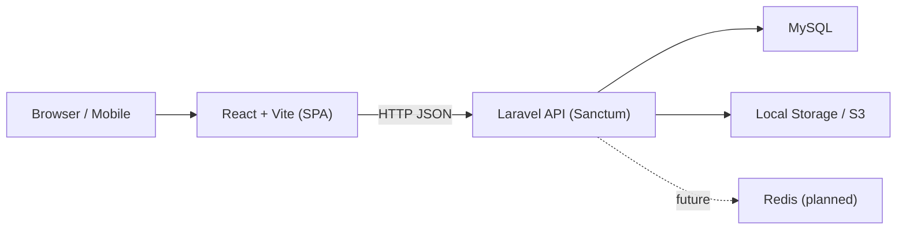
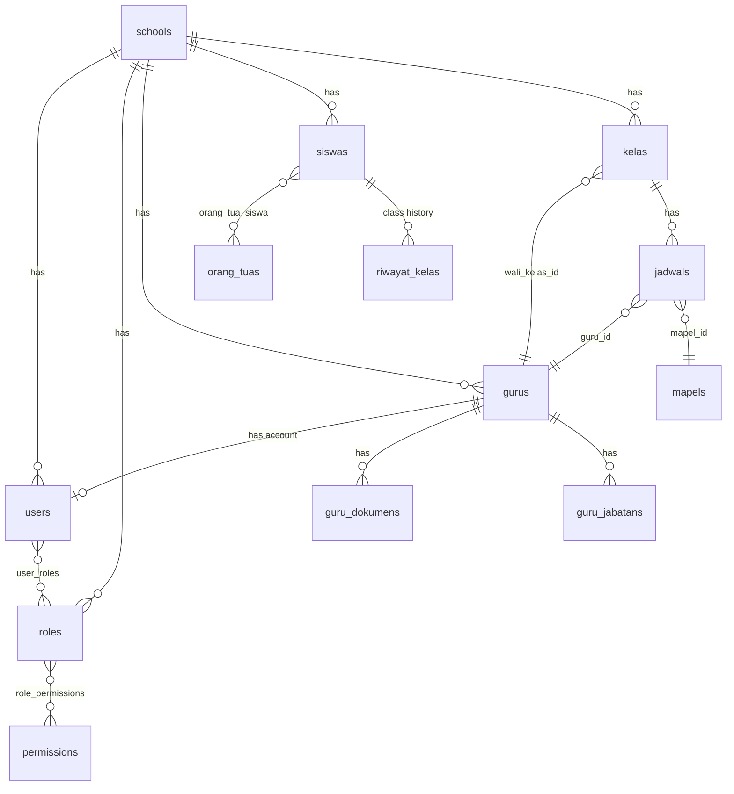

# PROJECT CONTEXT

> **Single source of truth for AI coding agents.**
> Read this file BEFORE writing any code. After reading, you should understand the full project: what it is, how it works, and how to develop it correctly.

---

## 1. Project Identity

| Field | Value |
|---|---|
| **Project Name** | SIAKAD (Sistem Informasi Akademik) / Scholara |
| **Project Type** | Multi-tenant SaaS School Management System |
| **Purpose** | Cloud-based academic information system deployable across thousands of madrasah/Islamic schools in Indonesia |
| **Target Users** | Operators, teachers, principals, parents, students, treasurers, school staff |
| **Target Institution** | Madrasah (MI, MTs, MA) and general schools (SD, SMP, SMA, SMK) |
| **Problem Solved** | Replace manual record-keeping with a digital system operable by non-IT staff; eliminate double data entry for Dapodik/EMIS reporting |
| **Core Value** | "5 solid features are better than 20 fragile ones" — quality over quantity |
| **License** | MIT |
| **Repository** | `Sahal111/Scholara_` |

---

## 2. Executive Summary

Scholara/SIAKAD is a multi-tenant SaaS platform for school management built with **Laravel 12 (API)** + **React 19 (SPA)**. It uses a **shared database with `school_id`** for tenant isolation. The system supports **13 tenant-level roles** (after `super_operator` was merged into `operator`) and a separate **platform admin tier**. Current development: Phase 0 (multi-tenant foundation) completed, Phase 1 (backend refactor) mostly completed, Phase 2 (frontend refactor) in progress, and several Phase 3-5 modules (LMS, Keuangan, PPDB, BK, Perpustakaan, Surat/TU) have early implementations.

**Key architectural decision (September 2026):** RBAC has been restructured to reflect real-world school organizational structure. `wakasek` is now the **owner of academic policy** (kurikulum, tahun ajaran, program pendidikan, mapel, kelas, jadwal), while `operator` is strictly the **administrative executor** (data input, import/export, sinkronisasi). This is a differentiating feature vs. competitors (Skoola, Kamadeva, APPSO) which bundle academic policy into a single "admin" role.

---

## 3. Product & Domain Overview

### Domain Concepts (verified in docs + source code)

| Concept | Description |
|---|---|
| **Sekolah/Madrasah** | Tenant unit — each school is an isolated tenant |
| **Tahun Ajaran** | Academic year (e.g., 2025/2026) — per school |
| **Semester** | Half-year academic period within a tahun ajaran |
| **Guru** | Teacher — extensive profile (identity, employment, certifications, documents, transfers) |
| **Siswa** | Student — profile, class assignment, attendance, parents |
| **Orang Tua/Wali** | Parent/guardian — linked to children |
| **Kelas** | Classroom — has homeroom teacher (wali kelas) |
| **Mata Pelajaran** | Subject/course |
| **Jadwal** | Schedule — teacher-subject-class-timeslot mapping |
| **Absensi** | Attendance records |
| **PPDB** | Student admission (planned) |
| **Keuangan** | Finance — tuition billing and payments (planned) |
| **DMS** | Document Management System for teacher credentials |
| **LMS** | Learning Management System (tables created, features planned) |
| **BK** | Guidance counseling module (tables created) |
| **Perpustakaan** | Library module (tables created) |
| **Surat/TU** | Administrative letters/correspondence (tables created) |

### Modules by Implementation Status

| Module | Status |
|---|---|
| Auth (login, register, multi-role) | `[IMPLEMENTED]` |
| Multi-tenant (SchoolScope, TenantMiddleware) | `[IMPLEMENTED]` |
| Master Data Guru (CRUD, photo, detail, import/export) | `[IMPLEMENTED]` |
| Master Data Siswa (CRUD, photo, class assign, transfer) | `[IMPLEMENTED]` |
| Master Data Kelas, Mapel, Jadwal, TA/Semester | `[IMPLEMENTED]` |
| Master Data Orang Tua | `[IMPLEMENTED]` |
| Absensi (input, recap) | `[IMPLEMENTED]` |
| Portal Guru, Kepsek, Ortu | `[IMPLEMENTED]` |
| Pengumuman, Galeri | `[IMPLEMENTED]` |
| Kalender Akademik | `[IMPLEMENTED]` |
| Naik Kelas | `[IMPLEMENTED]` |
| RBAC (13 roles, permissions table) | `[IMPLEMENTED]` |
| DMS (Document Management) | `[IMPLEMENTED]` — GuruDokumenController + frontend tabs |
| LMS (Materi, Tugas, Ujian) | `[IMPLEMENTED]` — Controllers + Guru frontend pages |
| Keuangan (Tagihan, Pembayaran, Jenis Tagihan) | `[IMPLEMENTED]` — Controllers + Bendahara frontend pages |
| PPDB (Calon Siswa, Berkas, Pembayaran) | `[IMPLEMENTED]` — Controllers + AdminPPDB frontend pages |
| BK (Konseling, Catatan) | `[IMPLEMENTED]` — Controllers exist |
| Perpustakaan (Buku, Peminjaman) | `[IMPLEMENTED]` — Controllers exist |
| Surat/TU (Surat, Legalisir) | `[IMPLEMENTED]` — Controllers exist |
| Akademik (Nilai, Rapor) | `[PLANNED]` — permissions seeded, no controllers yet |
| Platform Admin Dashboard | `[PLANNED]` — Phase 8 |

---

## 4. Project Scope

### In Scope (MVP)
- Multi-role authentication per school
- Master data: guru, siswa, kelas, mapel, jadwal, tahun ajaran, orang tua
- Attendance input and recap
- DMS for teacher documents
- Parent portal (child attendance, announcements)
- Dashboard per role
- Import/export Excel

### Out of Scope (Current)
- Nilai/Rapor (Phase 3)
- Keuangan/SPP (Phase 4)
- PPDB Online (Phase 5)
- Dapodik/EMIS integration (Phase 7)
- Plugin system (Phase 9+)

---

## 5. Current Project Status

### What's Working
- ✅ Full auth: login multi-role, register ortu, forgot/reset password
- ✅ Multi-tenant: cross-tenant prevention via subdomain + SchoolScope
- ✅ 13 system roles seeded per school (super_operator merged into operator)
- ✅ Master Data: Guru (split into 9 sub-controllers), Siswa, Kelas, Mapel, Jadwal, Tahun Ajaran, Orang Tua
- ✅ Portals: Guru, Kepsek, Ortu (functional with full pages)
- ✅ Bendahara portal with Keuangan module (Tagihan, Pembayaran, JenisTagihan)
- ✅ AdminPPDB portal with Calon Siswa management
- ✅ LMS for Guru (Materi, Tugas, Ujian)
- ✅ Absensi: input, recap, history
- ✅ Pengumuman, Galeri, Kalender Akademik
- ✅ DMS: guru dokumen upload, versioning, approval
- ✅ BK, Perpustakaan, Surat/TU — backend controllers exist
- ✅ FormRequests organized by domain (18 subdirectories)
- ✅ DetailGuru.jsx split into 8 tab components
- ✅ **Portal Wakasek Kurikulum** (September 2026) — portal dedicated dengan sidebar indigo, 11 halaman aktif: Tahun Ajaran, Kurikulum, Program Pendidikan, Mata Pelajaran, Kelas & Rombel, Data Guru/Siswa (view-only), Monitoring Absensi, Pengumuman, Laporan, Profil. Route `/wakasek/*` dengan API `/wakasek/*` sendiri.
- ✅ **RBAC Wakasek-Operator Split** (September 2026) — wakasek = pemilik kebijakan akademik (tahun ajaran, kurikulum, program, mapel, kelas, jadwal, rapor), operator = pelaksana administrasi (guru, siswa, import/export). Diimplementasikan via: migration RBAC fix, SchoolSeeder update, route `wakasek.php` baru, permission guards di 20+ halaman operator, OperatorSidebar restrukturisasi dengan grup "Referensi Akademik".
- ⬜ WaliKelas, GuruBK, TataUsaha, Pustakawan, AdminKeuangan, Siswa, SuperAdmin — dashboard only (placeholder)

### Current Phase
- Phase 0 (Multi-Tenant Foundation): `[COMPLETED]`
- Phase 1 (Backend Refactor): `[MOSTLY_COMPLETED]` — controller splitting done, FormRequests organized, ApiResponse trait in use
- Phase 2 (Frontend Refactor): `[IN_PROGRESS]` — reusable components exist, React Query hooks created, AppLayout adopted by 14/14 roles (layout unification COMPLETED), missing UI components COMPLETED
- Phase 3-5 modules (LMS, Keuangan, PPDB): `[EARLY_IMPLEMENTATION]` — controllers and basic frontend exist
- **RBAC Academic Split** (September 2026): `[COMPLETED]` — wakasek/operator permission split fully implemented across backend + frontend

### Technical Debt
- Layout unification: 14/14 roles now use `AppLayout.jsx` — SiswaLayout & SuperAdminLayout migrated via extracted sidebar components (SiswaSidebar.jsx, SuperAdminSidebar.jsx) `[COMPLETED]`
- Multiple sidebars exist (OperatorSidebar, WakasekSidebar, Sidebar) — OperatorSidebar sudah direstrukturisasi dengan grup Referensi Akademik; perlu unifikasi lebih lanjut `[IN_PROGRESS]`
- OperatorSidebar: menu kebijakan akademik dipindah ke grup "Referensi Akademik" (view-only, badge "Waka") `[COMPLETED — September 2026]`
- Some pages still use `useEffect` + axios instead of React Query `[COMPLETED]` — DashboardKepsek.jsx migrated; remaining useEffect usages are all valid (form reset, UI sync, non-fetch)
- `MasterGuru.jsx` split into modular components (MasterGuru, ModalImportGuru, ModalExportGuru, ModalPerhatianData, guruConstants) `[COMPLETED]` — reduced from 114KB (2516 lines) to 35KB (442 lines)
- `TambahEditGuru.jsx` is still large (~64KB) `[NEEDS_ATTENTION]`
- `app/Observers/` folder does not exist — Observer pattern not yet implemented `[NOT_STARTED]`
- `app/Models/create_new_role_users.php` — was misplaced in Models directory `[FIXED]` — deleted (functionality covered by TestingUserSeeder)

---

## 6. Tech Stack

| Layer | Technology | Version | Purpose |
|---|---|---|---|
| Backend Framework | Laravel | 12.x | REST API server |
| Backend Language | PHP | ≥ 8.2 | Server-side logic |
| Frontend Framework | React | 19.x | SPA client |
| Build Tool | Vite | 8.x | Frontend bundler |
| Styling | Tailwind CSS | 4.x | Utility-first CSS |
| Server State | TanStack React Query | 5.x | Data fetching/caching |
| HTTP Client | Axios | 1.18.x | API communication |
| Routing (Frontend) | React Router DOM | 7.x | Client-side routing |
| Auth | Laravel Sanctum | 4.x | Token-based auth |
| Database | MySQL | 8.x | Primary data store |
| Icons | Lucide React | 1.21.x | Icon library |
| Charts | Recharts | 3.x | Data visualization |
| Date | Day.js | 1.11.x | Date formatting |
| PDF Export | jsPDF + AutoTable | 4.x / 5.x | Client-side PDF |
| Excel (Frontend) | SheetJS (xlsx) | 0.18.x | Client-side Excel |
| Excel (Backend) | PhpSpreadsheet | 5.9.x | Server-side Excel |
| Toast | react-hot-toast | 2.x | Notifications |
| Linter | OxLint | 1.69.x | JS/TS linting |
| Testing | PHPUnit | 11.x | Backend testing |
| Cache/Queue (planned) | Redis | ≥ 6.0 | Production cache & queue |

> **Note**: PhpSpreadsheet IS installed in `composer.json` (v5.9). CLAUDE.md states it is NOT installed — this is **outdated**. The actual `composer.json` includes `"phpoffice/phpspreadsheet": "^5.9"`.

---

## 7. System Architecture



### Multi-Tenant Strategy
**Shared Database with `school_id`** — every operational table row has `school_id`. Laravel `SchoolScope` (Global Scope) automatically injects `WHERE school_id = ?` on all queries.

### Tables WITHOUT school_id (global)
- `plans`, `plan_features`, `saas_coupons`, `saas_coupon_usages`
- `global_users`, `global_user_schools`, `platform_admins`
- `schools`, `school_domains`, `school_subscriptions`
- `master_school_types`, `master_blood_types`
- System: `cache`, `jobs`, `sessions`, `migrations`, `personal_access_tokens`

### Tables with NULLABLE school_id (reference/master)
- `master_religions`, `master_education_levels`, `master_status_kepegawaians`, `master_jenis_cutis`, `master_marital_statuses`
- NULL = platform default, non-NULL = per-school override

### All other tables: school_id NOT NULL (operational)

---

## 8. Application Architecture

### Request Lifecycle
```
Request → TenantMiddleware (detect school from subdomain → set current_school_id)
  → auth:sanctum (validate token → load user)
  → PermissionMiddleware / RoleMiddleware (check permission)
  → FormRequest (validate input, reject 422)
  → Controller (slim — call Service, return Resource)
  → Service Layer (business logic, query via Model)
  → Model + SchoolScope (auto-filter school_id)
  → API Resource (format → JSON response)
```

### Backend Architecture (Clean Architecture Lite)
```
Controller  → Receive request, call service, return response
Service     → Business logic, DB-unaware of HTTP
Model       → Data access, relations, scopes
FormRequest → Input validation
API Resource→ Output formatting
Observer    → Side effects (audit log, notifications)
Job         → Async operations (import, export, email)
Event       → Module decoupling
Policy      → Resource-level authorization (ownership check)
```

### Frontend Architecture
```
Page Component  → Layout + orchestration (no detailed UI logic)
Tab/Section     → Part of large page (e.g., DetailGuru → TabIdentitas)
UI Component    → Reusable, domain-agnostic (DataTable, Modal, Badge)
API Hook        → useQuery/useMutation per domain (useGuru, useSiswa)
Auth Context    → Token, user, role — globally available
Axios Instance  → Single instance with interceptors (src/lib/axios.js)
```

---

## 9. Database Architecture

### Engine & Conventions
| Aspect | Standard |
|---|---|
| Engine | MySQL 8.x |
| Table naming | `snake_case`, plural: `gurus`, `siswas`, `orang_tuas` |
| Child tables | `{parent}_{domain}s`: `guru_dokumens`, `guru_jabatans` |
| Pivot tables | `{a}_{b}` alphabetical: `user_roles`, `role_permissions` |
| Column naming | `snake_case`: `nama_lengkap`, `tanggal_lahir` |
| Primary key | `BIGINT UNSIGNED AUTO_INCREMENT` named `id` |
| Public identifier | `CHAR(26) ULID` — never expose integer ID in API |
| Foreign keys | Suffix `_id`, FK constraint MANDATORY |
| Boolean | `TINYINT(1)` with `is_` prefix: `is_active`, `is_verified` |
| Timestamp action | Suffix `_at`: `verified_at`, `approved_at` |
| Enum | Human-readable values: `'Aktif'`, `'Laki-laki'` (not `1`/`0`) |
| Money | `DECIMAL(15,2)` |
| Soft delete | MANDATORY on master tables (`deleted_at`) |
| Audit fields | `created_by`, `updated_by`, `deleted_by`, `created_at`, `updated_at`, `deleted_at` |
| school_id | Column #2 after `id` on ALL operational tables |
| Indexing | Mandatory on: `school_id`, `status` columns, `created_at`, composite for frequent filters |

### Key Entities & Relationships


### Critical Table Name Facts (from actual DB)

| Common Assumption (WRONG) | Actual (CORRECT) |
|---|---|
| PK `siswas` = `nisn` | PK = `id`, `nisn` is unique column |
| PK `gurus` = `nuptk` | PK = `id`, `nuptk` is unique column |
| Table `siswa_kelas` | Table `riwayat_kelas` |
| FK `id_kelas` in absensis | FK `kelas_id` |
| FK `id_jadwal` in absensis | FK `jadwal_id` |
| FK `nuptk_wali` in kelas | FK `wali_kelas_id` |
| Column `kode_mapel` in mapels | Column `kode` |
| Table `jadwal_pelajaran` | Table `jadwals` |
| Table `mata_pelajaran` | Table `mapels` |
| Table `absensi` (singular) | Table `absensis` (plural) |

### Migration Count
**26 migration files** (as of August 2026), including the `merge_super_operator_into_operator` migration.

### Migration Rules
- Migration MUST have both `up()` and `down()` — `down()` must never be empty
- NEVER edit committed migrations — create a new migration instead
- File format: `{YYYY}_{MM}_{DD}_{sequence}_{action}_{table}.php`
- **NEVER run `migrate:fresh` or `migrate:reset`** without explicit permission

### Seeder Order (FK dependency)
1. GlobalSaaSSeeder → 2. SchoolSeeder (+ roles + permissions) → 3. TestingUserSeeder → 4. Data seeders (MasterDataSeeder, TahunAjaranSeeder, OperatorSeeder, PengumumanSeeder)

---

## 10. API Architecture

### Style & Conventions
| Aspect | Standard |
|---|---|
| Style | RESTful JSON API |
| Base URL | `https://{subdomain}.siakad.id/api/v1/...` |
| Versioning | URL path (`/v1/`) |
| Resource naming | Lowercase, singular or contextual: `/guru`, `/siswa` |
| Route params | ULID (not integer ID): `/guru/{ulid}` |
| Sub-resources | `/guru/{ulid}/dokumen` |
| Custom actions | PATCH: `/guru/{ulid}/dokumen/{id}/approve` |

### Response Format
```json
// Success single
{ "success": true, "data": { ... } }

// Success collection
{ "success": true, "data": [...], "meta": { "current_page":1, "total":74, ... }, "links": { ... } }

// Success action
{ "success": true, "message": "...", "data": { ... } }

// Error
{ "success": false, "code": "ERROR_CODE", "message": "...", "errors": { ... } }
```

### HTTP Status Codes
| Status | When |
|---|---|
| 200 | Success GET / action |
| 201 | Resource created |
| 204 | Success, no content (logout) |
| 401 | Unauthenticated / token expired |
| 403 | Forbidden / no permission |
| 404 | Not found |
| 422 | Validation failed |
| 429 | Rate limited |
| 500 | Server error |

### Error Codes
```
UNAUTHENTICATED, ACCOUNT_INACTIVE, ACCOUNT_PENDING, FORBIDDEN,
NOT_FOUND, VALIDATION_ERROR, CONFLICT, SCHOOL_SUSPENDED,
SCHOOL_TRIAL_EXPIRED, PLAN_LIMIT_REACHED, TOO_MANY_REQUESTS,
SERVER_ERROR, IMPORT_FAILED, IMPORT_PARTIAL
```

### Query Parameters
```
?page=1&per_page=15    pagination (max 100)
?search=ahmad          full-text search
?sort=nama&order=asc   sorting
?filter[status]=aktif  field filter
?include=jabatan       eager load (whitelisted)
```

### Required Headers
```
Authorization: Bearer {token}
Accept: application/json
Content-Type: application/json
X-Requested-With: XMLHttpRequest
```

### ApiResponse Trait
All controllers use `ApiResponse` trait via base `Controller.php`:
```php
$this->success($data);
$this->created($data, 'Message.');
$this->notFound('Message.');
$this->forbidden();
$this->error('Message', 'ERROR_CODE', 500);
```
**NEVER use `return response()->json([...])` directly.**

---

## 11. Backend Architecture (Laravel)

### Controller Rules
1. Every controller **extends** `App\Http\Controllers\Controller`
2. Every public method type-hints `JsonResponse`
3. **NO** `$request->validate()` in controllers — use FormRequest
4. **NO** direct DB queries — use Service or Model
5. Max **30-40 lines** per method
6. Max **8-10 methods** per controller
7. Large domains split into sub-controllers:
   ```
   Controllers/MasterData/Guru/
     GuruController.php           (main CRUD)
     GuruKeluargaController.php
     GuruKepegawaianController.php
     GuruDokumenController.php
     GuruImportController.php
     GuruExportController.php
   ```

### Service Layer Rules
- Contains ALL business logic
- **MUST NOT** know about HTTP (Request/Response)
- Can be called from: controller, job, command, seeder
- Wrap create/update in `DB::transaction()`

### Model Rules
- `$fillable` MUST be explicit — **NEVER use `$guarded = []`**
- `$hidden` must hide sensitive fields (password, tokens, audit fields)
- `$casts` for proper type casting
- Boot method: auto-set `ulid`, `created_by`, `updated_by`, `deleted_by`, add `SchoolScope`
- Use `SoftDeletes` trait on all master tables
- Named scopes: `scopeAktif()`, `scopeVerified()`

### Route Rules
- `routes/api.php` includes sub-files from `routes/api/`
- **Static routes BEFORE wildcards**: `/mapel/export` before `/mapel/{id}`
- All routes must have named routes
- All routes must have middleware (auth + permission)
- **NO inline closures** in route files

### Observer Rules
- Register in `AppServiceProvider`
- Handle side effects: audit logging, notifications, events
- `ActivityLog::record()` for every data mutation

### Current Route Files (actual source code)
```
routes/api/
  auth.php, operator.php, guru.php, kepsek.php, wakasek.php,  ← wakasek.php BARU Sept 2026
  ortu.php, absensi.php, master-data.php, public.php, lms.php,
  keuangan.php, ppdb.php, bk.php, perpustakaan.php, tata-usaha.php
```

---

## 12. Frontend Architecture (React)

### Principles
1. **Page = orchestration** — arrange layout, call components
2. **Component = reusable** — must not know about other domains
3. **Data = React Query** — no `axios` directly in components, no `useEffect` for data fetching
4. **State = minimal** — only store what can't be derived from React Query

### Hook Structure
```
src/hooks/
  api/         useAbsensi.js, useGuru.js, useKelas.js, useKeuangan.js, useLms.js, usePpdb.js, useSiswa.js
  useDebounce.js, useDisclosure.js, useSelectedAnak.js
```

> **Note**: UI hooks (`useDebounce`, `useDisclosure`) are NOT in a `ui/` subfolder — they are directly in `hooks/`.

### Component Rules
- Max **200-250 lines** per file — split into sub-components if larger
- UI components in `src/components/ui/` — MUST NOT import from `hooks/api/`
- Actual reusable components: Badge, ComingSoonDashboard, Confirm, DataTable, Modal, Pagination, Skeleton
- Actual reusable components: Badge, ComingSoonDashboard, Confirm, DataField, DataTable, EmptyState, FileUpload, Modal, Pagination, SearchInput, SectionCard, Skeleton, StatusBadge

### Layout Rule (MOSTLY ACHIEVED)
- **One `AppLayout` for all roles** — differences only in menu items and optional custom sidebar/topbar/footer
- **Current status**: 12/14 roles use `AppLayout.jsx` as their base layout
- **Using AppLayout (12)**: OperatorLayout, GuruLayout, KepsekLayout, OrtuLayout, WaliKelasLayout, BendaharaLayout, AdminPpdbLayout, WakasekLayout, GuruBkLayout, TataUsahaLayout, PustakawanLayout, AdminKeuanganLayout
- **Custom layout (2)**: SiswaLayout (blue theme), SuperAdminLayout (dark purple theme) — will be migrated when redesigned
- AppLayout supports two modes: simple (`menus` prop) and custom (`sidebar`/`topBar`/`footer` props for Operator)

### Auth Context
```jsx
const { user, token, isAuthenticated, login, logout, hasPermission, hasRole } = useAuth();
```

### Import Order Convention
1. React & built-in hooks
2. External libraries
3. Internal hooks
4. Components
5. Assets, utils, constants

Use `@` alias for `src/` (configured in `vite.config.js`).

### Lib Files
```
src/lib/
  axios.js    — Axios instance with interceptors
  storage.js  — localStorage helper utilities
```

---

## 13. Authentication & Authorization

### Authentication
- **Laravel Sanctum** token-based (`Bearer` via header)
- Token stored in `localStorage` on frontend
- Axios interceptor auto-attaches token
- 401 response → redirect to login, clear token

### Authorization — TWO LAYERS (MANDATORY)

**Layer 1: Route Middleware (permission check)**
```php
Route::delete('/{ulid}', [GuruController::class, 'destroy'])
    ->middleware('permission:master_data.guru.delete');
```

**Layer 2: Policy (ownership/tenant check)**
```php
// GuruPolicy — prevent cross-tenant access
public function delete(User $user, Guru $guru): bool {
    return $user->school_id === $guru->school_id;
}
```

> Middleware alone is NOT enough. User from school A with permission `guru.delete` must NOT be able to delete guru from school B.

---

## 14. Roles & Permissions

### Multi-Tier Authorization

**Tier 1: Platform Level** (`platform_admins` table)
| Level | Purpose |
|---|---|
| `super_admin` | Full SaaS architecture access |
| `admin` | School management, subscriptions, coupons |
| `support` | Impersonate tenant via `last_tenant_id` |
| `billing` | Invoices, tax, transactions |
| `readonly` | Platform audit logs |

**Tier 2: Tenant Level** (per-school `roles` + `permissions` tables)

| Slug | Name | System | Description |
|---|---|---|---|
| `operator` | Operator | ✓ | **Pelaksana administrasi** — CRUD guru, siswa, orang tua, import/export, manajemen akun, pengumuman, galeri. VIEW-ONLY untuk kebijakan akademik (tahun ajaran, kurikulum, mapel, kelas, program — domain wakasek). |
| `kepsek` | Kepala Sekolah | ✓ | Read-only all data + approve documents |
| `wakasek` | Wakil Kepala Sekolah Kurikulum | ✓ | **Pemilik kebijakan akademik** — kurikulum, tahun ajaran, program pendidikan, mapel, kelas, jadwal, rapor. View-only untuk guru & siswa. |
| `guru` | Guru | ✓ | Own class data + attendance + profile |
| `guru_bk` | Guru BK | ✓ | Counseling — NO access to grades |
| `wali_kelas` | Wali Kelas | ✓ | Guru + student report cards |
| `bendahara` | Bendahara | ✓ | Finance module |
| `admin_keuangan` | Admin Keuangan | ✓ | Input billing — NO approval |
| `tata_usaha` | Tata Usaha | ✓ | Letters, archives — NO grade access |
| `pustakawan` | Pustakawan | ✓ | Library management |
| `ortu` | Orang Tua | ✓ | Parent portal — own children data |
| `siswa` | Siswa | ✓ | Student portal |
| `admin_ppdb` | Admin PPDB | ✓ | Admissions module |

> **Note**: `super_operator` was merged into `operator` via migration `2026_08_17_000001_merge_super_operator_into_operator.php`. Operator now has ALL permissions.

System roles (`is_system = 1`) cannot be deleted by school operators.

### Permission Format
```
{module}.{resource}.{action}
Examples: master_data.guru.view, dms.approve, absensi.input, pengaturan.rbac.manage
```

### Permission Matrix (Key permissions)

> `super_operator` column removed — merged into `operator`. Operator now has ALL permissions.

| Permission | operator | kepsek | guru | wali_kelas | bendahara | ortu |
|---|:---:|:---:|:---:|:---:|:---:|:---:|
| master_data.guru.view | ✓ | ✓ | - | - | - | - |
| master_data.guru.create | ✓ | - | - | - | - | - |
| master_data.guru.delete | ✓ | - | - | - | - | - |
| dms.approve | ✓ | ✓ | - | - | - | - |
| dms.upload | ✓ | - | ✓ | ✓ | - | - |
| absensi.input | ✓ | - | ✓ | ✓ | - | - |
| absensi.view_all | ✓ | ✓ | - | - | - | - |
| keuangan.tagihan.manage | ✓ | - | - | - | ✓ | - |
| keuangan.pembayaran.input | ✓ | - | - | - | ✓ | - |
| pengaturan.rbac.manage | ✓ | - | - | - | - | - |

Full permission matrix in `doc2-rbac-design.md`.

---

## 15. Business Rules

### General
- Every feature must have: proper validation (FormRequest), consistent response (ApiResponse), no N+1 queries, mass assignment protection, permission checks
- Don't add new features until existing features are solid

### DMS (Document Management)
- Workflow: `draft → pending → approved/rejected → archived`
- Every upload creates a new version; old versions become `archived`, never deleted
- Every DMS action logged in `guru_dokumen_logs`
- File storage: `schools/{school_id}/guru/dokumen/{guru_ulid}/`
- File naming: `{ulid}_{slug}_v{version}.{ext}` — never use original filename

### Import/Export
- Import ALWAYS async via Job — never synchronous
- Export < 500 rows: sync allowed; > 500: async via Job
- Every import has a downloadable template
- Preview before execution — user confirms
- Import tracking via `guru_import_logs` table with status polling
- Import jobs: `tries = 1` — never retry (could duplicate data)

### Multi-Tenant
- `SchoolScope` auto-filters ALL queries
- `withoutGlobalScope(SchoolScope::class)` ONLY in PlatformAdminController
- Email uniqueness is PER SCHOOL (composite: `school_id` + `email`)
- File storage isolated per school: `storage/app/schools/{school_id}/`

### Naik Kelas (Class Promotion)
- Preview before mass processing
- Students moved from one class to next; `riwayat_kelas` updated

---

## 16. Naming Conventions

### Backend (PHP/Laravel)

| Type | Format | Example |
|---|---|---|
| Controller | PascalCase + Controller | `GuruController` |
| Service | PascalCase + Service | `GuruService` |
| Model | PascalCase singular | `Guru`, `TahunAjaran` |
| FormRequest | Action + Name + Request | `StoreGuruRequest` |
| API Resource | Name + Resource | `GuruResource` |
| Observer | Name + Observer | `GuruObserver` |
| Job | Verb phrase | `ProcessGuruImport` |
| Event | Past tense | `GuruCreated` |
| Policy | Name + Policy | `GuruPolicy` |
| Middleware | Name + Middleware | `TenantMiddleware` |
| Migration | snake_case + timestamp | `2026_08_01_000001_create_gurus_table` |
| Method | camelCase | `findByUlid`, `paginate` |
| Variable | camelCase | `$guruId`, `$tahunAjaran` |
| Constant | SCREAMING_SNAKE_CASE | `STATUS_AKTIF` |

### Frontend (React/JS)

| Type | Format | Example |
|---|---|---|
| Component | PascalCase.jsx | `DataTable.jsx` |
| Hook | use + camelCase.js | `useGuru.js` |
| Context | PascalCase + Context | `AuthContext.jsx` |
| Utility | camelCase.js | `formatDate.js` |
| Folder | camelCase or kebab-case | `masterDataGuru/` |
| Props | camelCase | `isLoading`, `onPageChange` |
| Handler | handle + Action | `handleSubmit`, `handleDelete` |

### Database
- Tables: snake_case plural (`gurus`, `siswas`, `tahun_ajarans`)
- Columns: snake_case (`nama_lengkap`, `tanggal_lahir`)
- Boolean: `is_` prefix (`is_active`)
- Timestamps: `_at` suffix (`verified_at`)
- FK: `_id` suffix (`user_id`)
- No abbreviations: `guru_dokumens` ✅, `guru_doc` ❌

### API Routes
```
GET    /v1/guru              ✅ lowercase, noun
POST   /v1/guru              ✅
GET    /v1/guru/{ulid}       ✅ ULID parameter
PATCH  /v1/guru/{ulid}/dokumen/{id}/approve  ✅ custom action
GET    /v1/getGuru           ❌ verb in URL
```

### Git
- Branch: `feature/guru-import`, `fix/foto-upload`, `refactor/split-controller`
- Commit: `{type}({scope}): {description}` — e.g., `feat(guru): add NUPTK validation`
- Types: `feat`, `fix`, `refactor`, `docs`, `test`, `style`, `chore`

---

## 17. Folder Structure

### Backend (Actual)
```
backend/
├── app/
│   ├── Http/
│   │   ├── Controllers/
│   │   │   ├── Auth/AuthController.php
│   │   │   ├── MasterData/
│   │   │   │   ├── Guru/                          ← 9 sub-controllers (SPLIT COMPLETED)
│   │   │   │   │   ├── GuruController.php
│   │   │   │   │   ├── GuruAdministrasiController.php
│   │   │   │   │   ├── GuruDokumenController.php
│   │   │   │   │   ├── GuruExportController.php
│   │   │   │   │   ├── GuruImportController.php
│   │   │   │   │   ├── GuruKeluargaController.php
│   │   │   │   │   ├── GuruKepegawaianController.php
│   │   │   │   │   ├── GuruKompetensiController.php
│   │   │   │   │   └── GuruMutasiController.php
│   │   │   │   ├── MasterDataSiswaController.php
│   │   │   │   ├── MasterDataKelasController.php
│   │   │   │   ├── MasterDataOrtuController.php
│   │   │   │   ├── MasterDataMapelController.php
│   │   │   │   ├── GuruCutiController.php
│   │   │   │   ├── JadwalPelajaranController.php
│   │   │   │   ├── TahunAjaranController.php
│   │   │   │   └── NaikKelasController.php
│   │   │   ├── Operator/OperatorController.php
│   │   │   ├── Guru/                              ← Guru portal (GuruController, GuruProfileController, GuruDokumenController, GuruKepegawaianController)
│   │   │   ├── Kepsek/                            ← KepsekController, KalenderAkademikController
│   │   │   ├── Ortu/OrtuController.php
│   │   │   ├── Absensi/AbsensiController.php
│   │   │   ├── Bk/                               ← CatatanController, KonselingController
│   │   │   ├── Keuangan/                          ← JenisTagihanController, PembayaranController, TagihanController
│   │   │   ├── Lms/                               ← AssignmentController, CourseMaterialController, ExamController
│   │   │   ├── Perpustakaan/                      ← BukuController, PeminjamanController
│   │   │   ├── Ppdb/                              ← BerkasPendaftarController, CalonSiswaController, PembayaranPpdbController
│   │   │   ├── TataUsaha/                         ← LegalisirController, SuratController
│   │   │   ├── GaleriController.php
│   │   │   ├── PengumumanController.php
│   │   │   └── Controller.php                    ← base, uses ApiResponse trait
│   │   ├── Middleware/
│   │   │   ├── TenantMiddleware.php
│   │   │   ├── PermissionMiddleware.php
│   │   │   ├── RoleMiddleware.php
│   │   │   └── InjectTokenFromCookie.php
│   │   └── Requests/                             ← 18 subdirs by domain (Absensi, Auth, Cuti, Galeri, Guru, Jadwal, Kelas, Kepsek, Keuangan, Lms, Mapel, NaikKelas, Operator, Ortu, Pengumuman, Ppdb, Siswa, TahunAjaran)
│   ├── Models/ (76 files + Scopes/)
│   │   ├── Scopes/SchoolScope.php
│   │   ├── Guru.php, Siswa.php, User.php, Role.php, Permission.php
│   │   ├── School.php, GlobalUser.php, PlatformAdmin.php
│   │   ├── LMS: Assignment, CourseMaterial, Exam, ExamQuestion, ...
│   │   ├── Keuangan: JenisTagihan, Tagihan, Pembayaran, ...
│   │   ├── BK: BkCatatan, BkKonseling
│   │   └── Perpustakaan: PerpustakaanBuku, PerpustakaanPeminjaman
│   ├── Services/
│   │   ├── GuruCutiService.php, GuruDokumenService.php
│   │   ├── GuruExportService.php, GuruImportService.php
│   │   ├── MutasiGuruService.php
│   │   └── Excel/
│   ├── Traits/ApiResponse.php
│   ├── Jobs/                                     ← ProcessGuruImport, ProcessGuruZipImport
│   ├── Policies/                                 ← GuruPolicy, KelasPolicy, SiswaPolicy
│   └── Providers/
│   ⚠️ NOTE: app/Observers/ does NOT exist — Observer pattern not yet implemented
├── database/
│   ├── migrations/                               ← 26 migration files
│   └── seeders/                                  ← GlobalSaaSSeeder, SchoolSeeder, MasterDataSeeder, TahunAjaranSeeder, OperatorSeeder, PengumumanSeeder, TestingUserSeeder
├── routes/
│   ├── api.php (includes sub-files)
│   └── api/                                      ← 14 route files: auth, operator, guru, kepsek, ortu, absensi, master-data, public, lms, keuangan, ppdb, bk, perpustakaan, tata-usaha
└── storage/app/schools/{school_id}/
```

### Frontend (Actual)
```
frontend/src/
├── components/
│   ├── layout/
│   │   ├── AppLayout.jsx                          ← unified layout, used by 12/14 roles
│   │   ├── OperatorSidebar.jsx, OperatorTopBar.jsx, OperatorFooter.jsx  ← direstrukturisasi Sept 2026
│   │   ├── WakasekSidebar.jsx                     ← BARU Sept 2026 — tema indigo, 5 grup menu
│   │   └── Sidebar.jsx
│   ├── ortu/
│   │   └── AnakSelector.jsx                       ← domain-specific component
│   └── ui/
│       ├── Badge.jsx, ComingSoonDashboard.jsx, Confirm.jsx
│       ├── DataTable.jsx, Modal.jsx, Pagination.jsx, Skeleton.jsx
│       ⚠️ Missing: StatusBadge, FileUpload, SearchInput, EmptyState, DataField, SectionCard
├── contexts/AuthContext.jsx
├── hooks/
│   ├── api/
│   │   ├── useAbsensi.js, useGuru.js, useKelas.js
│   │   ├── useKeuangan.js, useLms.js, usePpdb.js, useSiswa.js
│   ├── useDebounce.js, useDisclosure.js, useSelectedAnak.js
├── lib/
│   ├── axios.js
│   └── storage.js
├── pages/
│   ├── LandingPage.jsx, UnauthorizedPage.jsx      ← root-level pages
│   ├── auth/         LoginPage, RegisterOrtuPage, ForgotPasswordPage, ResetPasswordPage
│   ├── public/       PublicNavbar, PublicFooter, AboutPage, AkademikPage, ContactPage, GalleryPage, PpdbPage, ProgramPage
│   ├── operator/     DashboardOperator, ManajemenAkun, ApprovalOrtu, OperatorLayout
│   │   └── master/   masterDataGuru/ (MasterGuru, DetailGuru, TambahEditGuru + 8 tabs), masterDataSiswa/, masterDataKelas/, masterDataMapel/, masterDataOrtu/, masterDataTahunAjaranSemester/, MasterJadwal, NaikKelas, PengumumanOperator, GaleriOperator
│   ├── guru/         DashboardGuru, ProfilGuru, InputAbsensi, RekapAbsensiGuru, RiwayatAbsensiSiswaGuru, JadwalMengajarGuru, DataSiswaGuru, DetailSiswaGuru, PengumumanGuru, GuruLayout
│   │   └── lms/      LmsMateri, LmsTugas, LmsUjian
│   ├── kepsek/       DashboardKepsek, DataGuruKepsek, DataSiswaKepsek, DetailGuruKepsek, DetailSiswaKepsek, MonitoringAbsensi, KalenderAkademik, PengumumanKepsek, ProfilKepsek, KepsekLayout
│   ├── ortu/         DataAnak, AbsensiAnak, RiwayatAbsensiAnak, TambahAnak, PengumumanOrtu, ProfilOrtu, OrtuLayout
│   ├── bendahara/    DashboardBendahara, BendaharaLayout
│   │   └── keuangan/ DashboardKeuangan, JenisTagihan, Tagihan, Pembayaran
│   ├── adminppdb/    DashboardAdminPpdb, PpdbCalonSiswa, AdminPpdbLayout
│   ├── walikelas/    DashboardWaliKelas, WaliKelasLayout           ← placeholder
│   ├── wakasek/      DashboardWakasek, WakasekLayout, DataGuruWakasek, DetailGuruWakasek,
│   │                 DataSiswaWakasek, DetailSiswaWakasek, MonitoringAbsensiWakasek,
│   │                 PengumumanWakasek, LaporanWakasek, ProfilWakasek  ← IMPLEMENTED Sept 2026
│   │   └── akademik/ MasterKurikulum, MasterProgramWakasek, RecycleBinProgramWakasek,
│   │                 MasterMapelWakasek, MasterKelasWakasek, DetailKelasWakasek,
│   │                 DetailKelasPeriodeAkademikWakasek
│   ├── guru-bk/      DashboardGuruBk, GuruBkLayout                 ← placeholder
│   ├── tata-usaha/   DashboardTataUsaha, TataUsahaLayout           ← placeholder
│   ├── pustakawan/   DashboardPustakawan, PustakawanLayout         ← placeholder
│   ├── admin-keuangan/ DashboardAdminKeuangan, AdminKeuanganLayout ← placeholder
│   ├── siswa/        DashboardSiswa, SiswaLayout                   ← placeholder
│   └── superadmin/   DashboardSuperAdmin, SuperAdminLayout         ← placeholder
├── routes/ProtectedRoute.jsx
├── App.jsx, main.jsx
└── index.css, App.css
```

### Folder Rules
1. `components/ui/` — MUST NOT import from `hooks/api/` or `pages/`
2. `hooks/api/` — MUST NOT import from `components/` or `pages/`
3. `pages/` — may import from everywhere
4. `PublicNavbar.jsx` and `PublicFooter.jsx` are in `pages/public/` (correct location)
5. Layout files are inside each role's `pages/{role}/` directory (e.g. `OperatorLayout.jsx`, `GuruLayout.jsx`) — NOT in `components/layout/` (except AppLayout, OperatorSidebar/TopBar/Footer, Sidebar)
6. `components/ortu/` is an exception — contains `AnakSelector.jsx` (domain-specific shared component for Ortu portal)
7. No `utils/` folder — use `lib/`

---

## 18. UI/UX Design System

### Visual Direction
- Modern, professional, clean — inspired by Notion, Linear, Stripe Dashboard
- Islamic modern identity (Madrasah) — not ornate
- Skeleton loaders (not spinners), empty states with action buttons
- Max 3 clicks to any important feature

### Color Palette

| Role | Class / Hex | Usage |
|---|---|---|
| Primary | `bg-emerald-700` / `#15803D` | Main actions, active links, CTA buttons |
| Danger | `bg-red-600` / `#DC2626` | Delete, errors |
| Success | `bg-green-600` / `#16A34A` | Active, verified |
| Warning | `bg-amber-500` / `#F59E0B` | Pending, warnings |
| Neutral | `bg-gray-100` | Backgrounds |
| Accent | `#D4AF37` (gold) | Madrasah identity accent |

> **Decision**: Emerald Green `#15803D` (`bg-emerald-700`) is the **official primary color** — Madrasah identity. `bg-blue-600` references in older docs are outdated and must not be used for primary actions.

### Typography
- Font: Inter or Plus Jakarta Sans
- Heading: `text-2xl font-bold text-gray-900`
- Section title: `text-base font-semibold text-gray-700`
- Label: `text-sm font-medium text-gray-600`
- Body: `text-sm text-gray-900`
- Caption: `text-xs text-gray-500`

### Component Standards
| Component | Rule |
|---|---|
| Buttons | Primary (blue/green), Secondary (white+border), Danger (red), all with hover states |
| Tables | Always use `<DataTable>` component — never raw `<table>` |
| Modals | Always use `<Modal>` component — never custom |
| Delete | Always use `<ConfirmDialog>` before execution |
| Loading | Skeleton loader matching content shape — never "Loading..." text |
| Empty | `<EmptyState>` with icon, title, description, action button |
| Toast | `react-hot-toast` — never `alert()` |
| Icons | Lucide React only — never mix icon libraries |
| Pagination | MANDATORY for all lists — never load all data |
| Forms | Long forms (>5 fields) use modal or separate page |

### Spacing
- Card padding: `p-6`
- Section gap: `space-y-6`
- Field gap: `space-y-4`
- Inline items: `gap-3`

### Layout
- Sidebar: 280px
- Header: 72px
- Max content width: 1600px
- Responsive: Desktop → Laptop → Tablet → Mobile (sidebar becomes drawer)

### Border Radius
- Card: 18px, Button: 12px, Input: 12px, Modal: 20px

---

## 19. Security Standards

### MANDATORY
- **$fillable MUST be explicit** — NEVER `$guarded = []`
- **Audit fields NOT in $fillable** (`verified_at`, `verified_by`, `is_verified`, `deleted_by`)
- **Use `$request->validated()`** from FormRequest — NEVER `$request->all()`
- **Two-layer authorization**: middleware (permission) + policy (ownership)
- **File upload validation by MIME type**, not just extension
- **File names**: never use original user filename — generate safe names
- **Rate limiting** on sensitive endpoints (login: 5/min, import: 10/min)
- **SchoolScope** for cross-tenant data isolation
- **SQL injection prevention**: always use Eloquent/Query Builder with binding
- **Audit logging** via Observer for every data mutation
- **API Resource** for response — never expose raw model (filters sensitive fields)
- **ULID** in API responses — never expose integer ID
- **`.env` in `.gitignore`** — never commit real credentials
- **`APP_DEBUG=false`** in production

### FORBIDDEN
- `$guarded = []`
- `$request->all()` for mass assignment
- Raw SQL string interpolation
- Exposing integer IDs in API
- `withoutGlobalScope(SchoolScope)` outside PlatformAdminController
- Committing `.env` with real credentials

### RECOMMENDED
- Install `barryvdh/laravel-debugbar` in dev for N+1 detection
- Cache permission per user per request
- Use `declare(strict_types=1)` in new PHP files

---

## 20. Performance Standards

### MANDATORY
| Rule | Detail |
|---|---|
| N+1 Prevention | Always use eager loading (`->with([...])`) |
| Pagination | ALL list endpoints MUST paginate (default 15, max 100) |
| Select columns | List endpoints should `select()` only needed columns |
| Database indexes | Composite indexes on frequently filtered columns |
| Async heavy ops | Import/export via Job queue — never synchronous for large data |

### React Query Cache Strategy
| Data Type | staleTime |
|---|---|
| Rarely changing (kelas, mapel) | 5 minutes |
| Frequently changing (absensi) | 30 seconds |
| Realtime (import status) | Polling every 3 seconds |

### Backend Cache
- Cache school settings per school (3600s)
- Cache active tahun ajaran (300s)
- Invalidate in Observer when data changes
- **Don't cache** frequently changing data (attendance, document status)

---

## 21. Import & Export Standards

### Import Flow
```
Upload file → Validate (mime, size) → Save to temp → Create ImportLog (pending)
→ Dispatch Job → Return import_log_id → Frontend polls status every 3s
→ Job completes → Update ImportLog (done/partial/failed) → Show results
```

### Rules
- Import: ALWAYS async via Job
- Export < 500 rows: sync OK; > 500: async
- Every import has downloadable template
- Template: row 1 = headers, row 2 = example data
- Import job: `$tries = 1` (no retry — prevents duplicates)
- Import timeout: 5 minutes max
- Error reporting: row number + field + message

### Supported Format
- Excel (.xlsx) — backend uses PhpSpreadsheet (verified in composer.json)
- Some modules use ZipArchive + SimpleXML as alternative

---

## 22. Testing Standards

### Strategy & Priority
1. **Service Layer** — core business logic
2. **API Endpoint** (Feature Test) — response matches contract
3. **Import/Export** — error-prone
4. **Auth & Permission** — security critical

### Commands
```bash
php artisan test                        # run all tests
php artisan test --filter GuruServiceTest  # specific test
php artisan test --parallel             # faster parallel
```

### What to Test
- ✅ All API endpoints (happy + error path)
- ✅ Service methods with conditional logic
- ✅ Import/export flows
- ✅ Permission checks (role A can't access role B endpoints)
- ✅ Cross-tenant isolation (school A data not visible to school B)

### What NOT to Test
- ⚠️ Eloquent relationships
- ⚠️ Laravel helper methods
- ⚠️ Config/env loading

### Coverage Target (recommended, not mandatory)
- Feature test: > 80%
- Service: > 90%

---

## 23. Development Workflow

### Before Starting a Task
1. Read `PROJECT_CONTEXT.md`
2. Inspect relevant existing implementation
3. Check existing components/services before creating new ones
4. Understand the scope — confirm before coding

### During Development
1. Create branch from `develop` (not `main`)
2. Follow naming conventions (doc 08)
3. Write FormRequest for validation
4. Write Service for business logic
5. Use ApiResponse trait for responses
6. Use API Resource for output formatting
7. Use React Query hooks for data fetching

### Before Push
```bash
php artisan test            # backend tests pass
npm run lint                # frontend lint
php artisan migrate:status  # no pending migrations
grep -r "dd(" app/          # no debug statements
grep -r "console.log" src/  # no console.log
```

### Migration Changes
- NEVER edit existing migrations — create new ones
- New migration: `add_{column}_to_{table}_table.php`
- Down() MUST work (rollback support)

### PR Checklist
- [ ] Code follows naming conventions
- [ ] No dd()/console.log() left
- [ ] Migration has working down()
- [ ] Response uses ApiResponse trait
- [ ] Validation in FormRequest, not inline
- [ ] No N+1 queries
- [ ] Tests pass

---

## 24. AI Coding Rules

### Before Coding
1. Read `PROJECT_CONTEXT.md`
2. Read COMPLETED features list — don't modify completed files without explicit request
3. Inspect relevant existing implementation
4. Don't assume undocumented behavior
5. Follow existing architecture patterns
6. Reuse existing components/services — check before creating new
7. Don't introduce new dependencies without justification
8. Don't change database structure unnecessarily
9. Don't bypass RBAC
10. Don't break existing API contracts

### During Coding
11. One session = one feature — don't modify files outside scope
12. Don't refactor code that wasn't asked to be refactored
13. Search before write — verify model names, column names, component names
14. Static routes before wildcards in Laravel routing
15. Use `$request->validated()` not `$request->all()`
16. Wrap mutations in `DB::transaction()`
17. Every new endpoint needs auth middleware + permission middleware
18. Use targeted output — show only changed code, not entire file

### After Coding
19. Verify tests pass
20. Verify no debug statements left
21. Don't mark features as completed unless user explicitly says so

---

## 25. Forbidden Practices

### Backend
- ❌ `$guarded = []` — use explicit `$fillable`
- ❌ `$request->validate()` in controller — use FormRequest
- ❌ Direct DB query in controller — use Service
- ❌ `return response()->json([...])` — use ApiResponse trait
- ❌ `dd()`, `dump()`, `var_dump()` in production code
- ❌ Edit committed migration files
- ❌ `migrate:fresh` / `migrate:reset` without explicit permission
- ❌ Empty `down()` in migrations
- ❌ Hardcode `school_id`, `user_id`, or dynamic values
- ❌ Expose integer IDs in API response
- ❌ `withoutGlobalScope(SchoolScope)` in regular endpoints
- ❌ Inline closures in route files

### Frontend
- ❌ `axios` directly in components — use hooks/api/
- ❌ `useEffect` for data fetching — use React Query
- ❌ Create separate layouts per role — use single AppLayout
- ❌ Raw `<table>` elements — use DataTable component
- ❌ `alert()` for notifications — use react-hot-toast
- ❌ `console.log()` in production code
- ❌ Mix icon libraries — use Lucide React only
- ❌ Custom modal implementations — use Modal component

### General
- ❌ Install new dependencies without user confirmation
- ❌ Commit `.env` with real credentials
- ❌ Deploy to production without staging
- ❌ Auto-complete features without user saying "done"

---

## 26. Known Issues & Technical Debt

| Issue | Status |
|---|---|
| `MasterDataGuruController` split into 9 sub-controllers | `[COMPLETED]` |
| `DetailGuru.jsx` split into 8 tab components | `[COMPLETED]` |
| FormRequests organized into 18 domain subdirectories | `[COMPLETED]` |
| `super_operator` merged into `operator` | `[COMPLETED]` — migration applied |
| `useEffect` + axios for data fetching in some pages | `[IN_PROGRESS]` — migrating to React Query |
| Layout unification (14 files → AppLayout) | `[MOSTLY_COMPLETED]` — 12/14 roles use AppLayout; SiswaLayout & SuperAdminLayout remain custom |
| `WaliKelasLayout.jsx` had wrong path bug (`/wakasek/*`) | `[COMPLETED]` — fixed to `/walikelas/*` |
| Multiple sidebars (OperatorSidebar, Sidebar) | `[IN_PROGRESS]` — needs unification |
| `RoleMiddleware` still in use alongside `PermissionMiddleware` | `[IN_PROGRESS]` |
| `app/Observers/` folder does not exist | `[NOT_STARTED]` — Observer pattern not implemented |
| `app/Models/create_new_role_users.php` file misplaced in Models | `[FIXED]` — deleted (covered by TestingUserSeeder) |
| `MasterGuru.jsx` (~114KB) split into 5 modular files | `[COMPLETED]` — reduced to 35KB (442 lines) |
| `TambahEditGuru.jsx` (~64KB) still very large | `[NEEDS_ATTENTION]` |
| `PublicNavbar.jsx` and `PublicFooter.jsx` already in `pages/public/` | `[COMPLETED]` — was previously listed as issue |

---

## 27. Documentation Conflicts & Decisions

### CONFLICT 1: Primary Color

| Document | States |
|---|---|
| `10-ui-design-system.md` | Primary = `bg-blue-600` (Tailwind blue) |
| `desain.md` | Primary = Emerald Green `#15803D` (Islamic/Madrasah identity) |

**Impact**: Inconsistent UI color across the app.
**Decision**: **Emerald Green `#15803D`** is the official primary color (Madrasah identity). `10-ui-design-system.md` reference to `bg-blue-600` is outdated. All primary actions, active links, and CTA buttons must use emerald. Update `10-ui-design-system.md` to reflect this.

### CONFLICT 2: PhpSpreadsheet Availability

| Document | States |
|---|---|
| `CLAUDE.md` | "PhpSpreadsheet **belum diinstall**. Gunakan pure-PHP ZipArchive + SimpleXML" |
| `composer.json` (actual) | `"phpoffice/phpspreadsheet": "^5.9"` — IS installed |
| `12-import-export-standard.md` | References PhpSpreadsheet/IOFactory |

**Decision**: **Source code wins.** PhpSpreadsheet IS available (`composer.json` is ground truth). CLAUDE.md is outdated on this point. Use PhpSpreadsheet for Excel operations.

### CONFLICT 3: CSS Framework

| Document | States |
|---|---|
| `Spesifikasi_Backend_SaaS.md` | "Pure CSS Wajib... Tailwind CSS **dilarang keras**" |
| All other docs + actual code | Tailwind CSS 4.x is used throughout |

**Decision**: **Implementation wins.** Tailwind CSS 4.x is the actual CSS framework. `Spesifikasi_Backend_SaaS.md` contains an aspirational/outdated rule that was not followed.

### CONFLICT 4: Guru API Route Parameter

| Document | States |
|---|---|
| `doc3-api-contract.md` | `/guru/{nuptk}` — uses NUPTK as identifier |
| `05-laravel-standard.md` | `/guru/{ulid}` — uses ULID as identifier |
| `CLAUDE.md` | Mixed: some routes use `{nuptk}`, some `{id}` |

**Decision**: **ULID is the standard.** Per `03-database-standard.md` and `05-laravel-standard.md`, ULID is the public-facing identifier. Integer IDs and NUPTK are NOT used as route parameters. `doc3-api-contract.md` is outdated on this.

### CONFLICT 5: Layout Strategy

| Document | States |
|---|---|
| `06-react-standard.md` | "One AppLayout for all roles — NOT OperatorLayout, GuruLayout, etc." |
| `CLAUDE.md` + actual code | Separate layouts exist: `OperatorLayout.jsx`, `GuruLayout.jsx`, `KepsekLayout.jsx`, etc. |

**Decision**: The target architecture is **one unified AppLayout** (per `06-react-standard.md`). Separate layouts are technical debt being addressed in Phase 2.

### CONFLICT 6: Database Type

| Document | States |
|---|---|
| Most docs + actual | MySQL 8.x |
| `Spesifikasi_Backend_SaaS.md` | "Disarankan PostgreSQL" |

**Decision**: **MySQL 8.x** is the actual and standard database. PostgreSQL suggestion was not adopted.

---

## 28. Current Decisions

| Decision | Choice | Rationale |
|---|---|---|
| Multi-tenant | Shared DB + school_id | Simplest for early scale |
| Auth | Sanctum token | Already working |
| RBAC | Per-tenant custom roles | Each school has unique needs |
| API format | `{ success, code, data }` | Consistent, easy frontend handling |
| Validation | FormRequest (not inline) | Separation of concerns |
| Response | ApiResponse trait | No copy-paste per controller |
| Frontend state | React Query (TanStack) | Auto cache, no manual loading/error |
| File storage | `storage/app/schools/{school_id}/` | Per-tenant file isolation |
| **Primary color** | **Emerald Green `#15803D`** | Madrasah identity — `bg-blue-600` refs are outdated |
| **CSS framework** | **Tailwind CSS 4.x** | Actual implementation — pure CSS rule in `Spesifikasi_Backend_SaaS.md` not adopted |
| **Excel backend** | **PhpSpreadsheet** | Installed in `composer.json` — CLAUDE.md claim "belum install" is outdated |
| **Guru route param** | **ULID** | Standard per `03-database-standard.md` — nuptk/integer ID not used in routes |
| **Database** | **MySQL 8.x** | Actual — PostgreSQL suggestion in `Spesifikasi_Backend_SaaS.md` not adopted |
| Queue driver | Database (current) → Redis (scaling) | `[PLANNED]` |
| Search | MySQL LIKE → Meilisearch/Typesense | `[PLANNED]` |
| Email | SMTP → Amazon SES | `[PLANNED]` |
| Storage | Local → S3-compatible | `[PLANNED]` |

---

## 29. Roadmap

### Completed
- **Phase 0**: Multi-Tenant Foundation & Database Overhaul
  - school_id on all tables, SchoolScope, TenantMiddleware, PermissionMiddleware
  - Global users, platform admins, master reference tables
  - SaaS billing tables, LMS tables, notification engine tables
  - JSON i18n fields (national_ids, address_details)

### Current (In Progress)
- **Phase 1**: Backend Refactor — `[MOSTLY_COMPLETED]`
  - ✅ Split monolithic Guru controllers (9 sub-controllers)
  - ✅ FormRequests organized by domain (18 subdirs)
  - ✅ ApiResponse trait in use
  - ✅ Policies: GuruPolicy, KelasPolicy, SiswaPolicy
  - ⬜ Observers not yet implemented
  - ⬜ API Resources not yet systematically applied
- **Phase 2**: Frontend Refactor — `[IN_PROGRESS]`
  - ✅ React Query hooks created (7 api hooks)
  - ✅ Split DetailGuru.jsx into 8 tab components
  - ✅ Split MasterGuru.jsx into 5 modular components (MasterGuru, ModalImportGuru, ModalExportGuru, ModalPerhatianData, guruConstants)
  - ✅ `AppLayout.jsx` adopted by 12/14 roles — OperatorLayout migrated, WakasekLayout & WaliKelasLayout fixed
  - ⬜ SiswaLayout & SuperAdminLayout still custom (will be migrated when redesigned)
  - ⬜ Missing UI components: StatusBadge, FileUpload, SearchInput, EmptyState, DataField, SectionCard

### Early Implementations (Ahead of Roadmap)
- **Phase 3 (partial)**: Kalender Akademik `[DONE]`, Nilai/Rapor `[PLANNED]`
- **Phase 4 (partial)**: Keuangan (Tagihan, Pembayaran, JenisTagihan) `[EARLY_IMPL]` — controllers + bendahara frontend
- **Phase 5 (partial)**: PPDB (CalonSiswa, BerkasPendaftar, PembayaranPpdb) `[EARLY_IMPL]` — controllers + admin frontend
- **Other modules early**: LMS (Materi, Tugas, Ujian), BK (Konseling, Catatan), Perpustakaan (Buku, Peminjaman), Surat/TU — backend controllers exist

### Next Priority
- **Phase 2 completion**: Unify layouts, add missing UI components, finish React Query migration
- **Phase 3**: Akademik Core — nilai, rapor

### Future
- **Phase 6**: Notification Center (in-app, email, WhatsApp)
- **Phase 7**: Integrasi Dapodik & EMIS
- **Phase 8**: Platform Admin Dashboard
- **Phase 9+**: Enterprise Features (workflow engine, global search, plugin system, AI, CI/CD)

### Priority Rule
**Refactor Phase 2 must complete before adding more features.**
```
Phase 0 ✅ → Phase 1 ✅ (mostly) → Phase 2 (IN PROGRESS) → Phase 3+
```

---

## 30. Source of Truth Hierarchy

When information conflicts between sources, prioritize in this order:

1. **Actual source code** (models, controllers, migrations, components)
2. **Database schema / migrations** (column names, types, constraints)
3. **`composer.json` / `package.json`** (actual dependencies)
4. **`PROJECT_CONTEXT.md`** (this file — consolidated from all docs)
5. **Numbered documentation** (01-18 series in docs/)
6. **Architecture documents** (doc1, doc2, doc3)
7. **`CLAUDE.md`** (may have outdated information)
8. **`README.md`** / auxiliary documentation

---

## 31. Detailed Documentation Index

| Document | Purpose | Covered in PROJECT_CONTEXT | Keep as Detail Reference |
|---|---|---|---|
| `01-vision.md` | Project vision, mission, target users, scope | Yes | Yes |
| `02-architecture.md` | System architecture, request lifecycle, decisions | Yes | Yes |
| `03-database-standard.md` | DB schema, naming, indexes, migration, seeder | Yes | Yes |
| `04-api-standard.md` | API format summary, status codes, ApiResponse | Yes | No (covered here) |
| `05-laravel-standard.md` | Controller/Service/Model/Route templates | Yes | Yes — code examples |
| `06-react-standard.md` | React Query, hooks, components, layout | Yes | Yes — code examples |
| `07-rbac-standard.md` | RBAC model, permission format, implementation | Yes | Yes |
| `08-naming-convention.md` | All naming conventions | Yes | Yes — reference |
| `09-folder-structure.md` | Folder structure backend + frontend | Yes | Yes — reference |
| `10-ui-design-system.md` | Colors, typography, components, spacing | Yes | Yes |
| `10b-ui-consistency-rules.md` | UI code review checklist | Yes | Yes — checklist |
| `11-dms-standard.md` | DMS workflow, versioning, audit, endpoints | Yes | Yes |
| `12-import-export-standard.md` | Import/export flow, job, error handling | Yes | Yes — code examples |
| `13-security-standard.md` | Mass assignment, auth, file upload, SQL injection | Yes | Yes |
| `14-performance-standard.md` | N+1, pagination, caching, indexes | Yes | Yes |
| `15-testing-standard.md` | Testing strategy, feature/unit test examples | Yes | Yes — code examples |
| `16-contribution-guide.md` | Git flow, commit, PR, coding standards | Yes | Yes |
| `17-deployment-standard.md` | Server, Nginx, queue, SSL, backup | Yes | Yes — ops reference |
| `18-roadmap.md` | Development phases 0-9+ | Yes | Yes |
| `CLAUDE.md` | AI instructions, completed features, DB schema | Partially — some info outdated | Yes — completed features list |
| `desain.md` | Design philosophy, Madrasah theme, UI specs | Yes | Yes |
| `doc1-schema-design.md` | Multi-tenant schema design (detailed SQL) | Yes | Yes — SQL reference |
| `doc2-rbac-design.md` | Full RBAC design, permission matrix | Yes | Yes — full matrix |
| `doc3-api-contract.md` | API contract, response format, error codes | Yes | Yes — ApiResponse code |
| `README.md` (docs/) | Documentation index, tech stack, quick start | Yes | No (index only) |
| `Spesifikasi_Backend_SaaS.md` | SaaS architecture requirements | Partially — some conflicts | Yes — aspirational |

---

## 32. AI Quick Reference

```
Project:        SIAKAD / Scholara — Multi-tenant SaaS School Management System
Architecture:   Laravel API + React SPA, Shared DB with school_id
Backend:        Laravel 12.x (PHP 8.2+), Controller → Service → Model pattern
Frontend:       React 19 + Vite 8, React Query, Tailwind CSS 4
Database:       MySQL 8.x, school_id on all operational tables, ULID for public IDs
Authentication: Laravel Sanctum (token-based, Bearer header)
Authorization:  Two layers — PermissionMiddleware + Policy (ownership check)
Main Roles:     operator, kepsek, guru, wali_kelas, bendahara, ortu (13 total — super_operator merged into operator)
API Style:      RESTful JSON, /api/v1/, { success, data, meta, code }
UI Framework:   Tailwind CSS 4.x + Lucide React icons
Testing:        PHPUnit (php artisan test)
Deployment:     Nginx + PHP-FPM + MySQL + Redis (planned)

Critical Rules:
- NEVER use $guarded = []
- NEVER use $request->validate() in controller — use FormRequest
- NEVER query DB directly in controller — use Service
- NEVER use axios directly in React components — use hooks/api/
- NEVER use useEffect for data fetching — use React Query
- NEVER expose integer IDs in API — use ULID
- NEVER edit committed migrations — create new ones
- NEVER run migrate:fresh without permission
- ALWAYS use SchoolScope for multi-tenant isolation
- ALWAYS check both permission AND ownership (two-layer auth)
- ALWAYS paginate list endpoints
- ALWAYS use eager loading to prevent N+1
- ALWAYS use ApiResponse trait for responses
- Static routes BEFORE wildcard routes in Laravel
```